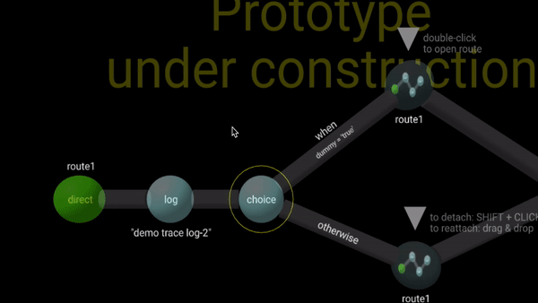
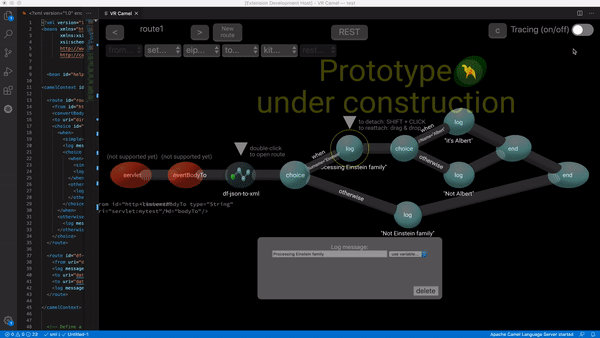

# How to...

This section describes how to perform some of the most common user actions with *Camel Designer*:

 - [Getting Started](#getting-started)
 - [Define REST definitions](#define-rest-definitions)
 - [Navigate the code](#navigate-the-code)
 - [Organise activities](#organise-activities)
 - [Trace Camel Exchanges](#trace-camel-exchanges)

<br>

## Getting Started

When starting from scratch and to start defining Camel routes, follow the steps below:

1. In VS Code, create a new workspace.
2. From the menu, select **File > New File**
3. To activate the designer view button, change the file language to XML, by either:
    - clicking on the language in the status bar (bottom right corner)
    - pressing the keys (Mac) <kbd>⌘</kbd>+<kbd>K</kbd> then <kbd>M</kbd>, (Windows) <kbd>Ctrl</kbd>+<kbd>K</kbd> then <kbd>M</kbd>
4. The preview button will appear (top right), click on it as shown in the animation below.
5. The Designer view will load, you can now model you Camel definitions.


<br>

## Define REST definitions

The visual editor includes a REST designer where you can define groups of REST methods. As you create new REST elements, the tool translates them into Camel REST DSL in the text editor.

It's important to know that REST definitions represent HTTP entry points to Camel. You can define REST methods such as GET/POST/PUT.
For each entry point defined (REST operation), Camel Designer links the REST method to a Camel Route that will process the request. REST Camel routes require to have a `'direct'` starting activity.

You can start defining your REST operations and later define your Camel routes. You can also start defining your Camel routes first and then your REST operations. Just make sure your REST operations are correctly linked to your Camel routes.

On the example below, we assume a Camel Route `route1` already exists, and we'd like to define a GET operation that triggers the Camel route. To include a new REST definition to the *Camel* project, follow the steps below:

1. In the visual editor, click on the <kbd>REST</kbd> button. This action activates the REST viewer.
2. From the <kbd>rest..</kbd> menu, select the option: <kbd>new group...</kbd>. This action will create a new REST group
3. From the <kbd>rest..</kbd> menu, select the option: <kbd>GET</kbd>. This action will define a GET operation with a `direct` call activity.
4. Click on the `direct` activity and select on the configuration pane `route1`
5. If `route1` exists, you can double click on the direct activity to jump to the Camel Route definition

<br>

The animation below illustrates how to interact with the REST editor:


<br>

## Navigate the code

Moving around with ease to inspect different Camel routes and activities is important.

There are two ways for users to move around the code.

1. Interact with the Visual Editor:
    - when you click on activities the camera will move and focus on the selected activity. The configuration pane will display related information and available options.
    - to step back, or gain freedom of movement, use the arrow keys to move around the scene. Automatic camera control will reactivate when you click on an activity.

2. Interact with the Text editor
    - clicks on the text editor will reposition the text cursor. *Camel Designer* will react and move the camera setting focus on the corresponding activity.
    - if the cursor is replaced in a different route, *Camel Designer* will switch and show the selected *Camel* route.

<br>

The animation below illustrates how to navigate the code by interacting with the XML source code:

  

<br>

## Organise activities

One of the main motivation to use Visual Editors is to gain the ability to intuitively understand processing flows.

While working with process definitions, you might want to:
  - move activities around for better readability.
  - change order of activities

There are two ways for users to organise the code.

1. Interact with the Visual Editor:
    - use 'Drag & Drop' to move activities around. Click on an activity and drag it where needed.
    - use 'Detach/Attach' on detachable activities to change executional order of activities. To discover 'detachable' activities press <kbd>SHIFT</kbd> , they will be highlighted in yellow. While <kbd>SHIFT</kbd> is pressed you can click on the activity, and then drag it to a new position.

2. Interact with the Text editor
    - As an alternative, you can close the Visual Editor, then cut/paste portions of Camel XML code to reorganise to your needs. Then open the Visual Editor which will show the new activities layout.

    > **Attention**: \
    Ensure the newly organised code is valid, Camel Designer does not currently implement a code validation process. If the code is not valid it will result in unexpected behaviour.

<br>

The animation below illustrates how to detach/attach activities:

  

<br>

## Trace Camel Exchanges

As part of the development process, it's important to validate the code executes as expected. Tracing allows you to have a magnifying glass to inspect each activity's data input/output, and to have an overall view of the execution path the process follows.

The current tracing functionality in *Camel Designer* allows you to connect to a running Camel instance and obtain live tracing information. The user can interact with the interface to pick executed jobs and inspect them.

These are the requirements to enable tracing:

1. A Java process with a Camel Context needs to be up and running
2. The above Camel instance needs to be Jolokia enabled (HTTPS is currently not supported)
3. The Camel XML code running in the Java process needs to match the code displayed in *Camel Designer*

If the above conditions are met, tracing can be enabled. Tracing options and switches are located in the upper right corner of the screen.


Follow the steps below to visualise traces:

1. Click on the <kbd>C</kbd> button (for configuration) and ensure the URL to your remote Camel/Jolokia instance is correct.
2. Click <kbd>ok</kbd> to accept and close the tracing configuration panel.
3. Click on the switch to turn ON tracing (grey is OFF, blue is ON). If the connection to Jolokia is unsuccessful, an alert message will show and tracing will stay disabled.
4. When tracing has been enabled enabled, trigger a job to be executed in Camel (via HTTP or other means).
5. Camel Designer has a timer and will repeatedly poll the Java process for new traces.
6. When a new Trace is collected, the Camel Exchange ID will pop up on screen. If more traces are collected, then multiple Exchange IDs will be listed.
7. Click on the Exchange ID you'd like to inspect. This action will highlight in yellow the path execution in the process definition.
8. To inspect headers and body data, hover your mouse over the highlighted links.
9. The tracing configuration panel allows you to select the data to be displayed (headers/body).
10. You can discard a trace by clicking the cross button in the Exchange ID.
11. When you're done, you can disable tracing by clicking in the ON/OFF switch.

<br>

The animation below illustrates how tracing is operated:

  

<br>

### How to enable Jolokia

Java processes running Camel do not include Jolokia by default. You will need to manually add Jolokia and configure your instance to allow connections from tracing clients.

The example below illustrates how to do so, based on a Fuse Spring Boot (v1) instance.

1. Include the following dependency in your POM file:

    ```xml
    <dependency>
        <groupId>io.hawt</groupId>
        <artifactId>hawtio-springboot-1</artifactId>
    </dependency>
    ```

2. Include the following parameters in the `application.properties` file:

    ```properties
    management.port=10001

    # enable management endpoints for healthchecks and hawtio
    endpoints.enabled = false
    endpoints.hawtio.enabled = true
    endpoints.jolokia.enabled = true
    endpoints.health.enabled = true
    management.health.defaults.enabled=false
    camel.health.enabled=false
    camel.health.indicator.enabled=true
    endpoints.jolokia.sensitive=false
    endpoints.hawtio.sensitive=false
    hawtio.authenticationEnabled=false
    ```
3. Restart the Java process.

    If the Java process is configured as above and running locally where VSCode is running, then the default URL would be valid:

       http://localhost:10001/hawtio/jolokia
---

